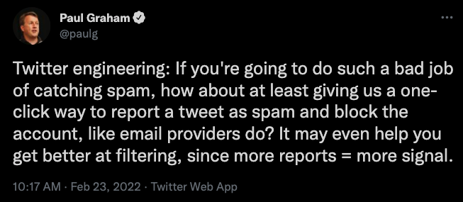
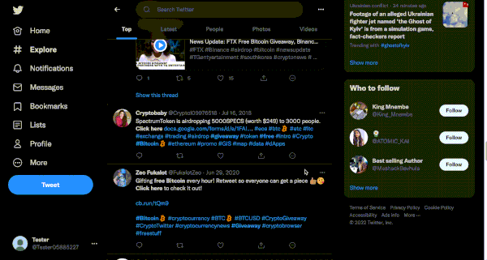

# TRAB - Tweet Reporter and Blocker

TRAB is a Chrome extension that gives you a single button to do two things with a single click:

- Mark a Tweet as spam, and
- Block the Tweet's creator

## Inspiration

[This](https://twitter.com/paulg/status/1496549841912094733) Tweet by Paul Graham was the inspiration for TRAB

## Installation

Recommended: TRAB can be found on the Chrome store [here](https://chrome.google.com/webstore/detail/trab-tweet-reporter-and-b/bahkpblcfiffamfljnfjeablplgnjnkg?hl=en-US)

Alternatively, follow [this](https://developer.chrome.com/docs/extensions/mv3/getstarted/#unpacked) link for instructions on how to 'Load an unpacked chrome extension' to download the source code from Github and install the extension.

## Screenshot

## License

[MIT](https://choosealicense.com/licenses/mit/)
